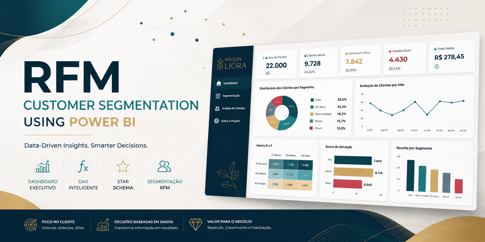
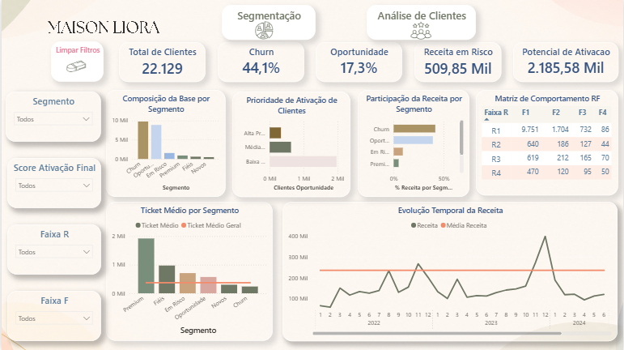
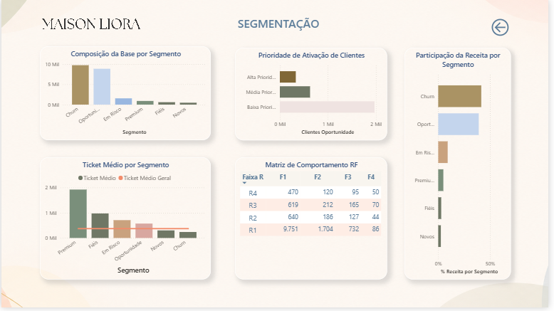
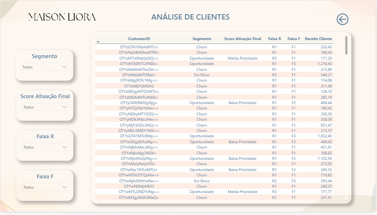
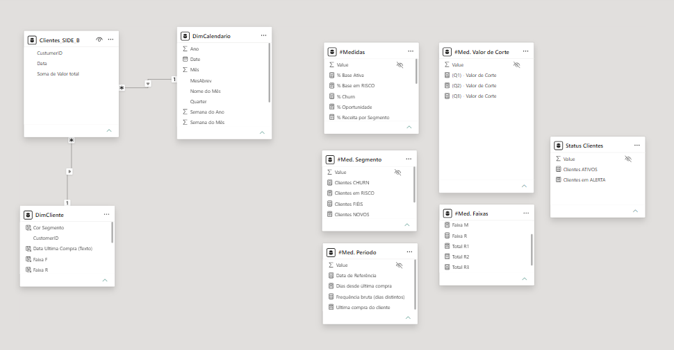

<p align="center">
  
</p>

# RFM Customer Segmentation using Power BI

<p align="left">
  
  
  
  
  
  
</p>

Projeto profissional de **Business Intelligence** desenvolvido em **Power BI** para segmentação de clientes utilizando a metodologia **RFM (Recência, Frequência e Valor Monetário)**.

A solução foi desenvolvida para a empresa fictícia **Maison Liora**, simulando um cenário corporativo de análise de comportamento de clientes, identificação de churn e apoio à tomada de decisão baseada em dados.

---

## 📖 Visão Geral

Este repositório reúne toda a documentação técnica do projeto, desde o entendimento do problema de negócio até as decisões de modelagem, implementação e otimização da solução.

O projeto foi desenvolvido seguindo boas práticas de Business Intelligence, Modelagem Dimensional e DAX, priorizando organização, desempenho e facilidade de manutenção.

---

## 🚀 Principais Funcionalidades

- Segmentação automática de clientes utilizando a metodologia RFM.
- Classificação dos clientes em segmentos estratégicos.
- Score de Ativação para priorização comercial.
- Dashboard executivo composto por três páginas analíticas.
- Modelagem dimensional em Star Schema.
- Navegação interativa e tooltips personalizados.

---

---

# 📷 Galeria do Projeto

## Dashboard Executivo

<p align="center">
  
</p>

## Segmentação de Clientes

<p align="center">
  
</p>

## Análise de Clientes

<p align="center">
  
</p>

## Modelo de Dados

<p align="center">
  
</p>

---


## 🛠️ Tecnologias Utilizadas

| Tecnologia | Finalidade |
|------------|------------|
| Power BI | Desenvolvimento do dashboard |
| Power Query | Transformação dos dados |
| DAX | Cálculos e indicadores |
| Star Schema | Modelagem dimensional |
| GitHub | Documentação e versionamento |
| Markdown | Documentação técnica |

---

## 📁 Estrutura do Repositório

```text
RFM-Customer-Segmentation-PowerBI
│
├── README.md
├── docs/
├── images/
├── pbix/
├── theme/
└── LICENSE
```

---

## 📚 Documentação Técnica

| Documento | Descrição |
|-----------|-----------|
| 01-business-problem.md | Problema de negócio |
| 02-dataset.md | Conjunto de dados |
| 03-data-model.md | Modelo dimensional |
| 04-business-rules.md | Regras de negócio |
| 05-rfm-methodology.md | Metodologia RFM |
| 06-dax-measures.md | Arquitetura da camada DAX |
| 07-dashboard.md | Dashboard e experiência do usuário |
| 08-performance.md | Estratégias de otimização |
| 09-insights.md | Principais insights do projeto |

---

## ⭐ Destaques da Solução

- Modelagem dimensional em Star Schema.
- Dimensão exclusiva de clientes (**DimCliente**).
- Segmentação automática baseada em RFM.
- Score de Ativação para priorização das ações comerciais.
- Dashboard executivo desenvolvido com foco em usabilidade, organização e desempenho.

---

## 🚀 Roadmap

### Versão 1.0

- [x] Modelagem dimensional.
- [x] Segmentação RFM.
- [x] Dashboard executivo.
- [x] Score de Ativação.
- [x] Documentação técnica.

### Próximas Evoluções

- [ ] Atualização incremental dos dados.
- [ ] Integração com banco de dados relacional.
- [ ] Segmentação dinâmica por parâmetros.
- [ ] Publicação no Power BI Service.

---

## 👤 Autor

**Alexandre Oliveira**

Especialista em Business Intelligence, Analytics e Engenharia de Dados, com foco no desenvolvimento de soluções analíticas utilizando Power BI, SQL e Python.

**LinkedIn:** *(adicionar link)*

**GitHub:** *(adicionar link)*