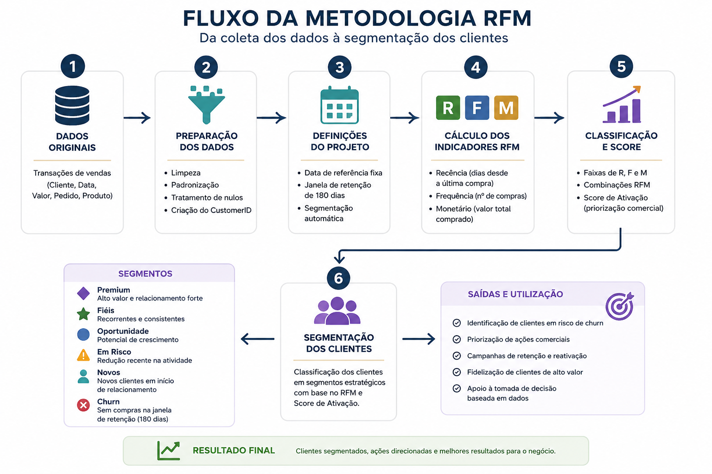

# Metodologia RFM

## 🎯 Objetivo

Apresentar como a metodologia RFM foi aplicada para segmentar os clientes e apoiar decisões estratégicas de negócio.

---

## 📖 Visão Geral

A metodologia **RFM (Recência, Frequência e Valor Monetário)** foi utilizada para analisar o comportamento de compra dos clientes da Maison Liora.

A combinação desses três indicadores permitiu identificar diferentes perfis de relacionamento e orientar ações de retenção, fidelização e reativação.

---

## 📝 Adaptação ao Projeto

A implementação foi adaptada às necessidades do negócio, considerando:

- Data de referência fixa para os cálculos.
- Janela de retenção de **180 dias**.
- Segmentação automática dos clientes.
- Score de Ativação para priorização comercial.

---

## 🔄 Fluxo da Metodologia

> **Figura 2 — Fluxo simplificado da classificação RFM.**

  

---

## 🔍 Bastidores da Solução

A metodologia RFM foi ampliada com regras específicas de negócio, tornando a segmentação mais aderente à realidade operacional da empresa e permitindo transformar indicadores em ações práticas.

---

## ✅ Conclusão

A adaptação da metodologia RFM tornou possível identificar diferentes perfis de clientes e apoiar decisões comerciais de forma objetiva e orientada por dados.